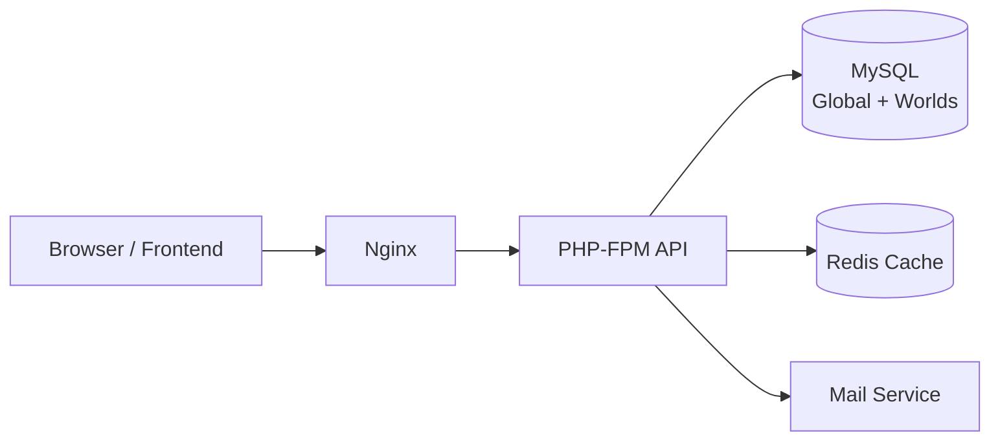

# Travian Solo Game Server

Production-ready PHP backend with Dockerized services, PHPUnit test suite, and enterprise-grade cleanup and documentation.


[](https://github.com/Ghenghis/Travian-Solo/stargazers)
[](LICENSE)

> Build. Expand. Conquer. A clean, modern backend for solo‑play Travian with a clear path to intelligent AI factions.

---

## ✨ Feature Highlights

- Clean root structure, guarded scripts, and comprehensive docs
- Dockerized stack (Nginx + PHP‑FPM + MySQL + Redis)
- PHPUnit test suite with isolated header tests
- Lint and quality tools wired (PHPCS, PHP‑CS‑Fixer, PHPStan, PHPMD)
- Future‑ready AI/NPC roadmap and visuals in `docs/AI/`

### Visual Overview



### Game Modes (Planned)

| Mode | Description |
|------|-------------|
| Human vs World | Single human vs many AI factions |
| Co‑op Allies | Human with AI teammates vs others |
| Betrayal Season | Trust dynamics and betrayals over time |
| Wonder Rush | Race to late‑game objectives |

## Overview

- PHP 8.2 runtime (Dockerized)
- MySQL, Redis, Nginx via docker-compose
- Tests: PHPUnit (unit/integration), all green
- Quality guardrails: PHPCS (PSR-12), PHP-CS-Fixer, PHPStan, PHPMD, PHPLoc
- Non-destructive cleanup scripts under `scripts/guarded`

## Quick Start

```bash
# Start services
docker-compose up -d

# Run unit tests
docker-compose exec php vendor/bin/phpunit --colors=always --testdox
```

## Project Structure

- `sections/` Production PHP code (do not move during cleanup)
- `tests/` PHPUnit tests
- `docker/` Docker configuration
- `scripts/` Utilities and guarded cleanup scripts
- `storage/` Runtime storage (e.g., email logs)
- `docs/` Documentation (includes future `docs/AI` add-ons)

## Testing

```bash
docker-compose exec php vendor/bin/phpunit --colors=always --testdox
```

Header-emitting tests run in isolated processes to avoid CLI header warnings.

## Quality and Automation

Composer scripts (after `composer install`):

```bash
composer lint          # PHPCS PSR-12
composer lint:fix      # PHPCS auto-fix
composer fixer         # PHP-CS-Fixer dry-run
composer fixer:apply   # PHP-CS-Fixer apply
composer stan          # PHPStan static analysis
composer md            # PHPMD code smells (phpmd.xml)
composer loc           # PHPLoc metrics
composer dup           # PHPCPD duplicates
```

Guarded cleanup (DRY-RUN by default):

```powershell
pwsh -NoProfile -File .\scripts\guarded\guarded-cleanup.ps1 -Stage Stage1       # inventory
pwsh -NoProfile -File .\scripts\guarded\guarded-cleanup.ps1 -Stage Stage4       # link checks
pwsh -NoProfile -File .\scripts\guarded\guarded-cleanup.ps1 -Stage Stage5 -Apply # tests
pwsh -NoProfile -File .\scripts\guarded\guarded-cleanup.ps1 -Stage Stage7       # repair (dry-run)
```

## Documentation

- See `docs/README.md` and the detailed guides under `docs/`
- The `docs/AI/` folder is reserved for future AI integration and remains unchanged during cleanup

## Acknowledgements & Contributors

- Foundational work and significant help by [advocaite](https://github.com/advocaite) and [WallcroftUK](https://github.com/WallcroftUK).
- Full contributor history: [Contributors Graph](https://github.com/Ghenghis/Travian-Solo/graphs/contributors)

[](https://github.com/Ghenghis/Travian-Solo/graphs/contributors)

## License

See `LICENSE`.