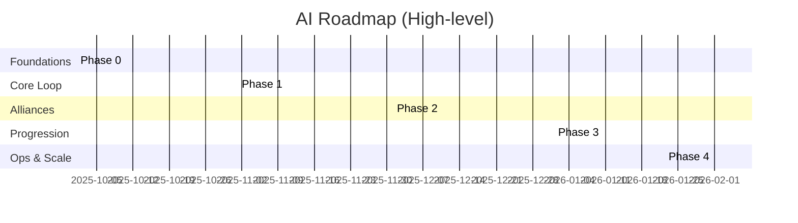
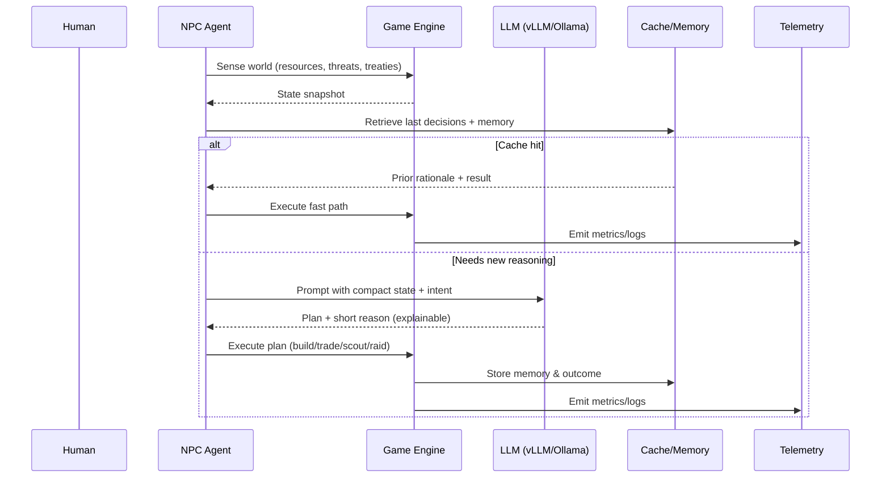
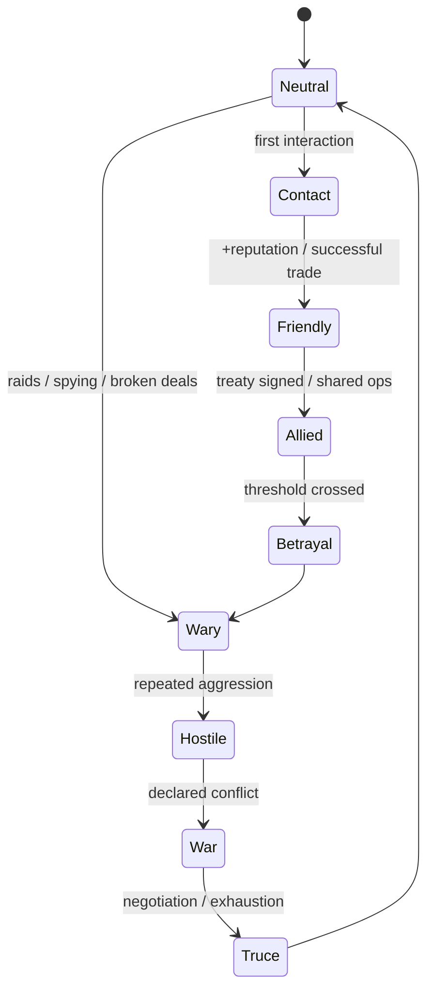
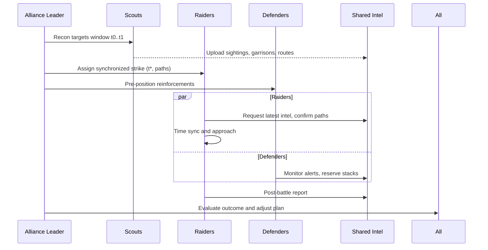
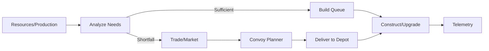
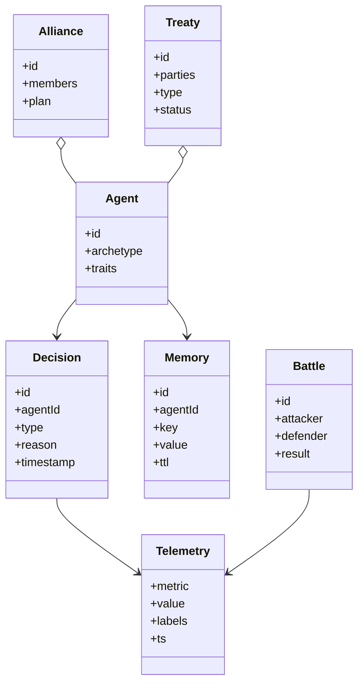
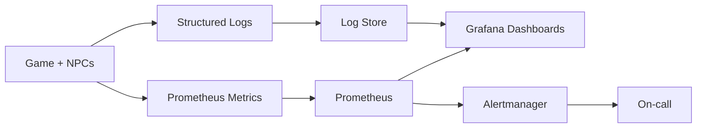

# AI/NPC Roadmap — Solo Play and Beyond

> One human. Hundreds of intelligent factions. Friends, foes, neutrals — all thinking, trading, building, plotting.
>
> This roadmap distills the AI vision in docs/AI/ into a phased, shippable plan.

## 🎯 Vision (TL;DR)
- Local‑first LLM + deterministic game logic
- Cohesive NPC behavior across economy, combat, diplomacy
- Multi‑agent alliances with shared intel and synchronized ops
- Ethical, explainable AI with readable difficulty scaling
- Production‑grade ops: tests, dashboards, telemetry, replays

### System Map

```mermaid
flowchart LR
    Human(Human Player)
    NPCs[NPC Agents (Alliance, Raider, Scout, Trader, Defender)]
    LLM[vLLM/Ollama Inference]
    Orchestrator[GPU Orchestrator]
    Engine[Game Engine\n(Economy/Combat/Diplomacy)]
    Telemetry[Prometheus/Grafana]
    Storage[(AI Memory\n+ Telemetry DB)]

    Human <---> Engine
    NPCs --> Engine
    Engine --> LLM
    LLM --> Orchestrator
    Engine --> Telemetry
    NPCs <--> Storage
    Engine <--> Storage
```

## 🧭 Pillars (from the AI docs)
- Framework: AI-FRAMEWORK-MASTER-BLUEPRINT.md, AI-Framework-Vision.md, AI-SYSTEM-COMPLETE-SUMMARY.md
- Behavior: NPC-BEHAVIOR-SYSTEM.md, AI-NPC-OVERVIEW.md
- Economy/Build: BUILDING-ECONOMY-ENGINE.md
- Combat: COMBAT-AI-SYSTEM.md
- Diplomacy/Alliances: DIPLOMACY-ALLIANCE-AI.md
- Multi-Agent: MULTI-AGENT-COORDINATION.md
- Learning: CROSS-WORLD-LEARNING.md
- Personality: PERSONALITY-PSYCHOLOGY.md
- Advanced Tactics: ADVANCED-STRATEGIES.md
- LLM Integration: LOCAL-LLM-INTEGRATION.md, API-INTEGRATION-LAYER.md
- Data/Architecture: DATA-MODELS-ARCHITECTURE.md
- Performance: PERFORMANCE-SCALING.md
- Quality/DevOps: TESTING-MONITORING-DEVOPS.md
- Ethics/Balance: AI-ETHICS-BALANCE.md

## 🗺️ Phased Delivery Plan

> Ship progress in fun, playable slices. Each phase has a clear demo and gate checks.



### Phase 0 — Foundations (Infra, Telemetry, Guards)
- Local LLM serving (vLLM/Ollama), request routing, caching
- Agent loop skeletons, queues, time budgets, backpressure
- Prometheus metrics, Grafana dashboards, structured logs
- Test harnesses for economy/combat; replay mechanism

Milestone Demo: 10 idle NPCs alive, producing metrics and safe no‑ops.

---

### Phase 1 — Core Solo Loop (Economy + Basic Combat + Basic Diplomacy)
- Economy/build queue engine; resource optimization; convoy routes
- Battle simulator v1; scouting; risk‑aware raids; retaliations
- Diplomacy thresholds: neutrality, friendship, hostility; simple treaties (NAP, Ally, War)
- Explainable decisions: short "why" notes attached to important actions

Milestone Demo: 1 human vs 20 NPCs; balanced raids, visible treaties, readable reasons.

---

### Phase 2 — Alliances and Coordination
- Roles: leader, scout, raider, defender; dynamic reassignment
- Shared intelligence network; synchronized multi‑target strikes
- Negotiation playbooks; tribute/trade; betrayal thresholds

Milestone Demo: 1 human + 2 AI allies vs 30 NPCs; timed joint operations.

---

### Phase 3 — Progression, Personality, Advanced Strategy
- Personality traits and archetypes; adaptive moods
- Curriculum/self‑play ladders; cross‑world learning store
- Deception/feints, multi‑front pressure, eco‑bait tactics
- Difficulty scaling profiles with guardrails

Milestone Demo: Season narrative with rivalries; difficulty ladder from "Chill" to "Warlord".

---

### Phase 4 — Ops, Scale, and Polish
- Priority queues; batch generation; GPU scheduling; multihost
- Load testing suites; alarms; success SLOs
- Seasonal replays; balance/tuning dashboards

Milestone Demo: 1 human vs 200 NPCs stable for 24h; insights dashboard.

## 🧪 Gate Checks (per phase)
- Functional: economy ticks, raids, treaties, roles
- Performance: p95 decision latency within budget
- Observability: dashboards populated, alerts quiet
- Explainability: top actions show short reasons
- Stability: ≥N hours without crash; memory steady

### Milestone Checklist
- [ ] P0: 10 idle NPCs with healthy telemetry
- [ ] P1: 1 human vs 20 NPCs balanced demo
- [ ] P2: Coordinated alliance strike with roles
- [ ] P3: Personality + advanced strategies active
- [ ] P4: 1 human vs 200 NPCs stable 24h

## 🧩 NPC Role Kit (starter set)
- Scout — intel, pathing, report
- Raider — strike, evaluate losses, target next
- Defender — garrison, repair, reinforce
- Trader — convoy optimizer, market haggler
- Leader — sets alliance plan, assigns roles

## 🎮 Solo Play Scenarios
- Human vs World (FFA)
- Co‑op with Allies (team AI)
- Betrayal Season (trust slowly erodes)
- Wonder Rush (race objectives)

## 🧱 Ethics & Balance
- No perfect information; cost for intel
- Human‑readable difficulty knobs
- Anti‑exploit guardrails; fair resource rules

## ⚙️ Performance & Scaling
- Priority queues and budgets per decision class
- Batch inference, speculative exec, cache layers
- GPU orchestrator with load‑aware routing

## 📊 Telemetry & Replays
- Prometheus metrics (decisions, queues, errors, latencies)
- Grafana: NPC overview, battles, economy, diplomacy
- Replays: compressed event logs, in‑game highlights

## 🧠 NPC Decision Loop (Sequence)



## 🤝 Diplomacy State Machine



## 🕸️ Multi‑Agent Coordination



## 🛠 Economy / Build Pipeline



## 🚦 LLM Routing & Orchestration

```mermaid
graph TB
    Client[NPC Decision Requests]
    Router[Prompt Router
    (priority, budget, cache)]
    Fast[Inference A
    (fast/cheap)]
    Deep[Inference B
    (deep/slow)]
    Cache[(LLM Cache)]
    
    Client --> Router
    Router -->|P<=3| Fast
    Router -->|P>3 or complex| Deep
    Router --> Cache
    Fast --> Cache
    Deep --> Cache
```

## 🗃 Data Model Overview (Simplified)



## 📡 Observability Pipeline



## 🔗 Source Map (read next)
- AI-FRAMEWORK-MASTER-BLUEPRINT.md — end‑to‑end architecture
- LOCAL-LLM-INTEGRATION.md — run models locally (vLLM/Ollama)
- NPC-BEHAVIOR-SYSTEM.md — behavior pipeline
- DIPLOMACY-ALLIANCE-AI.md — treaties and betrayals
- COMBAT-AI-SYSTEM.md — battle decisions
- BUILDING-ECONOMY-ENGINE.md — economy/queues
- TESTING-MONITORING-DEVOPS.md — quality & ops

> PRs welcome. Keep docs/AI/ content authoritative; ROADMAP.md aggregates and links while we build.
